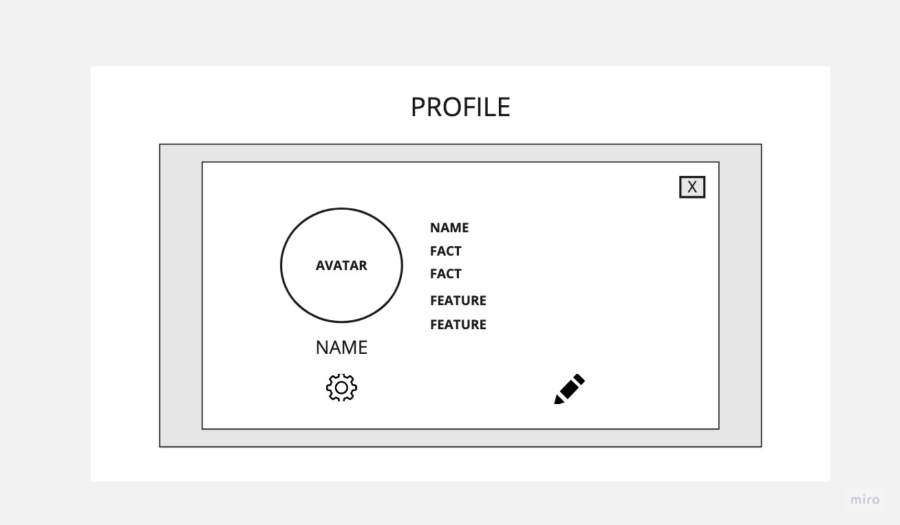
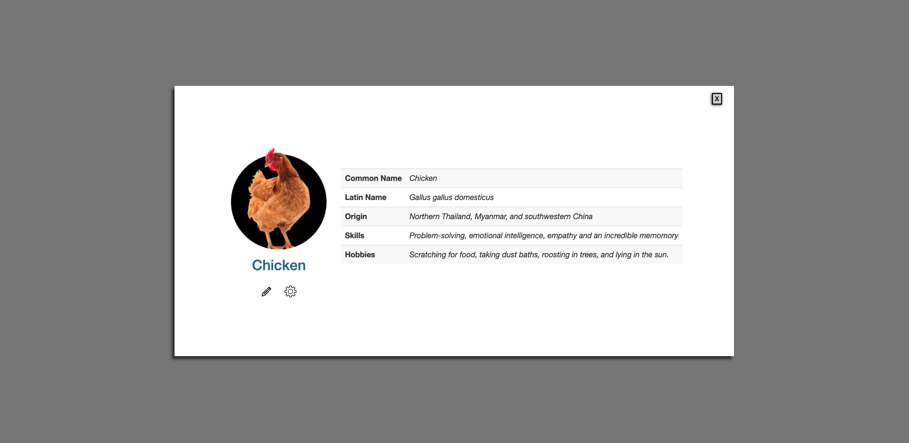
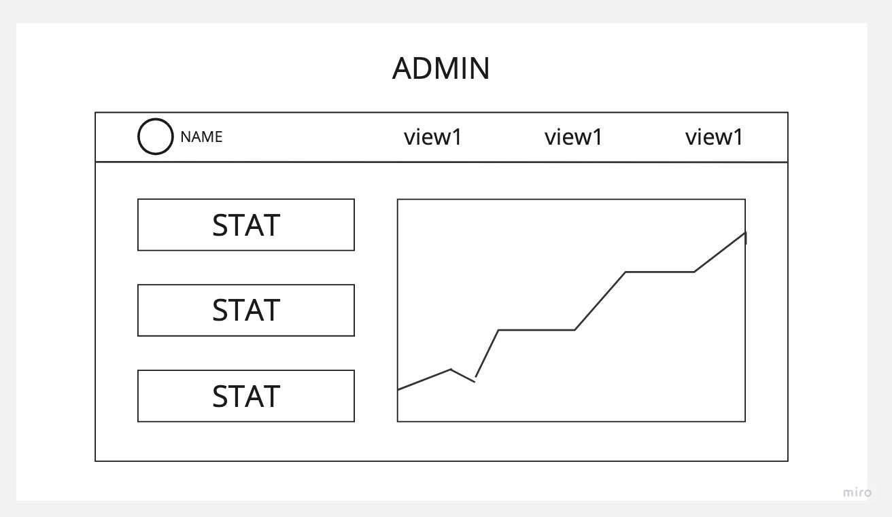
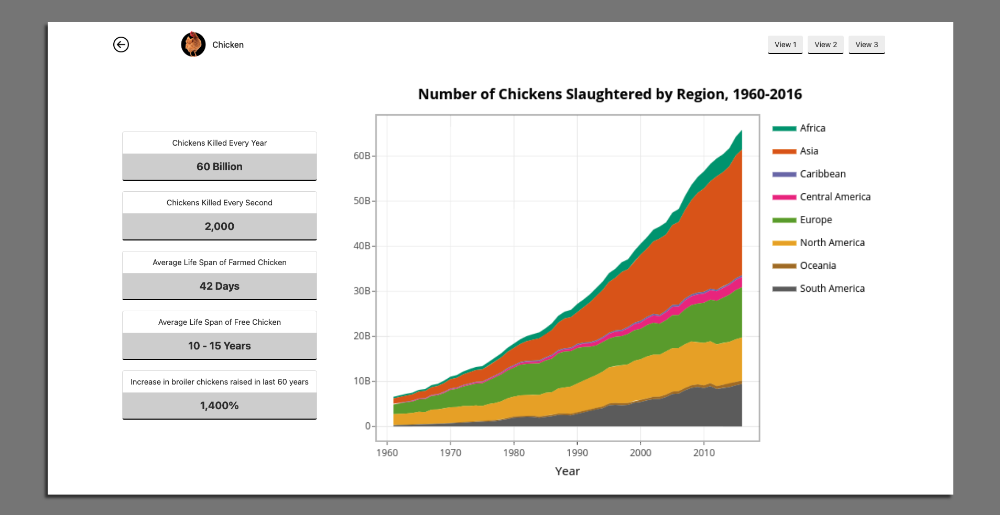

## About this repo

This is an assigment to create two wireframes and matching websites that incorprate Bootstrap classes in the styling

I chose to make a simple design since I had less than 24 hours to complete and its my first website using Bootsrap. As an animal rights activist, I usually look for ways to raisie awareness about the sentience of farmed animals and their unnecessary suffering

----

#### A few of the Bootstrap classes used...
```
- container
- table
- card
- list-group
- text-center
```

Clone or copy this repo and open in a code editor / server or your browser

### User profile page
#### `user.html`

>> Wireframe



>> Webpage




### Admin profile page
#### `admin.html`

>> Wireframe



>> Webpage




### Resources

- Bootstrap docs https://getbootstrap.com/
- Miro, free online design app https://miro.com/app/
- Per Scholas, awesome non profit tech training for people wanting to break into tech https://perscholas.org/
